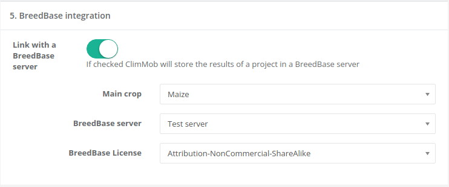

BreedBase ClimMob plug-in
==============

This plug-in allows to store [ClimMob](https://github.com/BioversityCostaRica/py3ClimMob) projects as studies in [BreedBase](https://breedbase.org/) servers that use [BrAPI](https://brapi.org/) 2.0.


Installing the plug-in
---------------

- Download the plugin

```sh
https://github.com/BioversityCostaRica/brapi_plugin.git
```

- Activate the ClimMob environment.

```
$ . ./path/to/ClimmobEnv/bin/activate
```

- Change directory of the BrAPI plugin.
```
$ cd brapi_plugin
```

- Build the plug-in
```
$ python setup.py develop
```

- Add the plug-in to the ClimMob list of plug ins by editing the following line in configuration file (.ini file)
```
    #climmob.plugins = examplePlugin
    climmob.plugins = brapi
```

- Run ClimMob again

## Features of the plug-in

### Project integration

The plug-in will modify the user interface for creating and editing projects by adding a section for BreedBase integration:



You need to indicate the main crop of the project, a BreedBase server with BrAPI 2.0 and a license for your data.

### Checks on your project

The plug-in will check your project to see if it can integrate with a BreedBase server. This is done by checking whether the project only use one technology and that such technology is a crop. Please note that the plugin does not control if the technology that you select for your project matches the Main crop in the project integration. The plug-in will show in ClimMob's Main Window whether the integration is possible.


The following icons could appear:

BreedBase integration was not selected.

BreedBase checks pending. This will appear when a project does not have technologies.

BreedBase integration is not possible. This happens when the project has technologies that are not crop or it has two or more technologies.

BreedBase integration is OK. 

### Sending data to BreedBase

ClimMob will send data to the selected BreedBase server automatically when a report has been generated. If the data in ClimMob has been cleaned, and a new report is generated, then the plug-in will update the BreedBase information.

## Information stored in BreedBase

### Project

Project information is stored as an Study in BreedBase. The complete information about the project is stored as additional information:

```json
{
    "active": true,
    "additionalInfo": {
      "user_name": "cquiros",
      "project_lat": "",
      "project_createpkgs": 0,
      "project_pi": "Carlos Quiros",
      "project_name": "BreedBase project",
      "breedbase_link": 1,
      "project_public": 0,
      "project_assstatus": 0,
      "project_lon": "",
      "climmob-server": "http://192.168.0.102:5900/",
      "project_active": 1,
      "project_createcomb": 0,
      "project_piemail": "cquiros@me.com",
      "project_dashboard": 1,
      "project_regstatus": 2,
      "project_abstract": "Project with BrAPI integration",
      "breedbase_url": "https://test-server.brapi.org/brapi/v2/",
      "project_creationdate": "2021-11-04 08:54:29",
      "project_cod": "brapi2",
      "project_cnty": "CR",
      "breedbase_server": "test",
      "project_localvariety": 1,
      "project_numcom": 3,
      "project_registration_and_analysis": 0,
      "project_numobs": 10,
      "project_tags": "maize",
      "breedbase_crop": "maize",
      "breedbase_license": "BY"
    },
    "commonCropName": "Maize",
    "contacts": [
      {
        "contactDbId": "e0756c9e-7740-49e1-adad-a9b2b4b160ed",
        "email": "cquiros@me.com",
        "instituteName": "CLIMMOB",
        "name": "Carlos Quiros",
        "orcid": null,
        "type": "PI"
      }
    ],
    "culturalPractices": null,
    "dataLinks": [],
    "documentationURL": "https://climmob.net",
    "endDate": "2021-11-09T14:29:23Z",
    "environmentParameters": [],
    "experimentalDesign": {
      "pui": "TRICOT",
      "PUI": "TRICOT",
      "description": "The experiment has a TRICOT design"
    },
    "externalReferences": [
      {
        "referenceID": null,
        "referenceSource": "CLIMMOB"
      }
    ],
    "growthFacility": null,
    "lastUpdate": {
      "timestamp": "2021-11-17T08:55:46Z",
      "version": "2021_11_17 08:55:46"
    },
    "license": "CC-BY",
    "locationDbId": null,
    "locationName": null,
    "observationLevels": [],
    "observationUnitsDescription": null,
    "seasons": [],
    "startDate": "2021-11-04T08:54:29Z",
    "studyCode": "CLIMMOB_cquiros_brapi2",
    "studyDescription": "Project with BrAPI integration",
    "studyName": "BreedBase Project",
    "studyPUI": null,
    "studyType": "Phenotyping",
    "trialDbId": null,
    "trialName": null,
    "studyDbId": "19502d5a-34ae-4c92-8754-f13c4cd4cee2"
}
```

### Traits, Methods, Scales and Variables

A trait in BreedBase is matched with a question type=”Ranking of options”. The trait will have type = Tricot. For each Trait there is one Method = Tricot and one Scale = Ranking. A variable is defines a one trait, with one method with one scale, therefore there are as many variables as traits. The complete information of a ClimMob Characteristic is stored in the trait and variable object in BreedBase ad additional information.

An example of a Trait

```json
{
    "additionalInfo": {
      "question_overallperf": 0,
      "question_village": 0,
      "qstgroups_id": "4581ab3c093d",
      "question_desc": "Overall Characteristic",
      "user_name": "bioversity",
      "question_requiredvalue": 1,
      "question_notes": "This is the overall Characteristic",
      "question_alwaysinasse": 0,
      "question_twoitems": "Overall, which option performed better?",
      "question_notobserved": 0,
      "question_perfstmt": null,
      "question_optperprj": 0,
      "question_dtype": 9,
      "question_asskey": 0,
      "question_posstm": "Overall, which option performed better?",
      "question_name": "Overall Characteristic",
      "question_reqinasses": 0,
      "question_tied": 0,
      "question_negstm": "Overall, which option performed worst?",
      "question_regkey": 0,
      "question_overall": 1,
      "question_moreitems": "Overall, which option is at position {{pos}}?",
      "question_code": "overallperf",
      "question_fname": 0,
      "question_quantitative": 0,
      "question_unit": "",
      "question_id": 204,
      "question_district": 0,
      "question_visible": 1,
      "question_cmp": null,
      "question_reqinreg": 0,
      "question_alwaysinreg": 0,
      "qstgroups_user": "bioversity",
      "question_father": 0
    },
    "alternativeAbbreviations": [],
    "attribute": null,
    "entity": null,
    "externalReferences": [
      {
        "referenceID": "cquiros-brapi2",
        "referenceSource": "CLIMMOB-PROJECT"
      },
      {
        "referenceID": "http://192.168.180.242:5900",
        "referenceSource": "CLIMMOB-SERVER"
      }
    ],
    "mainAbbreviation": null,
    "ontologyReference": null,
    "status": null,
    "synonyms": [],
    "traitClass": "TRICOT",
    "traitDescription": "Overall Characteristic",
    "traitName": "Overall Characteristic",
    "traitDbId": "8bcfe46c-9097-468f-a478-88e03915bf4e"
  }
```

Example of a Variable:

```json
{
    "additionalInfo": {
      "question_overallperf": 0,
      "question_village": 0,
      "qstgroups_id": "4581ab3c093d",
      "question_desc": "Overall Characteristic",
      "user_name": "bioversity",
      "question_requiredvalue": 1,
      "question_notes": "This is the overall Characteristic",
      "question_alwaysinasse": 0,
      "question_twoitems": "Overall, which option performed better?",
      "question_notobserved": 0,
      "question_perfstmt": null,
      "question_optperprj": 0,
      "question_dtype": 9,
      "question_asskey": 0,
      "question_posstm": "Overall, which option performed better?",
      "question_name": "Overall Characteristic",
      "question_reqinasses": 0,
      "question_tied": 0,
      "question_negstm": "Overall, which option performed worst?",
      "question_regkey": 0,
      "question_overall": 1,
      "question_moreitems": "Overall, which option is at position {{pos}}?",
      "question_code": "overallperf",
      "question_fname": 0,
      "question_quantitative": 0,
      "question_unit": "",
      "question_id": 204,
      "question_district": 0,
      "question_visible": 1,
      "question_cmp": null,
      "question_reqinreg": 0,
      "question_alwaysinreg": 0,
      "qstgroups_user": "bioversity",
      "question_father": 0
    },
    "commonCropName": "Maize",
    "contextOfUse": [],
    "defaultValue": null,
    "documentationURL": null,
    "externalReferences": [
      {
        "referenceID": "cquiros-brapi2",
        "referenceSource": "CLIMMOB-PROJECT"
      },
      {
        "referenceID": "http://192.168.180.242:5900",
        "referenceSource": "CLIMMOB-SERVER"
      }
    ],
    "growthStage": null,
    "institution": null,
    "language": "en",
    "method": {
      "additionalInfo": {},
      "bibliographicalReference": null,
      "description": null,
      "externalReferences": [],
      "formula": null,
      "methodClass": "TRICOT",
      "methodName": "TRICOT",
      "ontologyReference": null,
      "methodDbId": "048c5ff1-bfe6-407e-be47-b6aafe194640"
    },
    "ontologyReference": null,
    "scale": {
      "additionalInfo": {},
      "dataType": "Numerical",
      "decimalPlaces": 0,
      "externalReferences": [],
      "ontologyReference": null,
      "scaleName": "TRICOT Ranking",
      "validValues": {
        "categories": [],
        "max": null,
        "min": null
      },
      "scaleDbId": "689e6d22-20da-47d5-b2df-ecf3c1f28e37"
    },
    "scientist": "Carlos Quiros",
    "status": null,
    "submissionTimestamp": "2021-11-17T14:52:50Z",
    "synonyms": [],
    "trait": {
      "additionalInfo": {
        "question_overallperf": 0,
        "question_village": 0,
        "qstgroups_id": "4581ab3c093d",
        "question_desc": "Overall Characteristic",
        "user_name": "bioversity",
        "question_requiredvalue": 1,
        "question_notes": "This is the overall Characteristic",
        "question_alwaysinasse": 0,
        "question_twoitems": "Overall, which option performed better?",
        "question_notobserved": 0,
        "question_perfstmt": null,
        "question_optperprj": 0,
        "question_dtype": 9,
        "question_asskey": 0,
        "question_posstm": "Overall, which option performed better?",
        "question_name": "Overall Characteristic",
        "question_reqinasses": 0,
        "question_tied": 0,
        "question_negstm": "Overall, which option performed worst?",
        "question_regkey": 0,
        "question_overall": 1,
        "question_moreitems": "Overall, which option is at position {{pos}}?",
        "question_code": "overallperf",
        "question_fname": 0,
        "question_quantitative": 0,
        "question_unit": "",
        "question_id": 204,
        "question_district": 0,
        "question_visible": 1,
        "question_cmp": null,
        "question_reqinreg": 0,
        "question_alwaysinreg": 0,
        "qstgroups_user": "bioversity",
        "question_father": 0
      },
      "alternativeAbbreviations": [],
      "attribute": null,
      "entity": null,
      "externalReferences": [
        {
          "referenceID": "cquiros-brapi2",
          "referenceSource": "CLIMMOB-PROJECT"
        },
        {
          "referenceID": "http://192.168.180.242:5900",
          "referenceSource": "CLIMMOB-SERVER"
        }
      ],
      "mainAbbreviation": null,
      "ontologyReference": null,
      "status": null,
      "synonyms": [],
      "traitClass": "TRICOT",
      "traitDescription": "Overall Characteristic",
      "traitName": "Overall Characteristic",
      "traitDbId": "8bcfe46c-9097-468f-a478-88e03915bf4e"
    },
    "observationVariableDbId": "55a680f9-e259-481d-916e-1049b3ddf7c7",
    "observationVariableName": "Overall Characteristic"
  }
```

### Observations

One data row for a data collection moment in ClimMob will generate 3 observations in BreedBase. Each observation will have study ID, followed by package code, followed by data collection ID, followed by the variableID and followed by the observation ID. Each observation has the germplasm and a unique ranking value (Best, Worst, or Neutral). The observation timeStamp is taken from the submission of the data to ClimMob.

Observation 1:

```json
{
    "additionalInfo": {},
    "collector": null,
    "externalReferences": [],
    "germplasmDbId": null,
    "germplasmName": "Variety A",
    "observationTimeStamp": "2021-11-08T18:24:26Z",
    "observationUnitDbId": null,
    "observationUnitName": null,
    "observationVariableDbId": "eeb6cabb-8332-40d1-a0d8-68ab040ef21a",
    "observationVariableName": "Best of taste",
    "season": null,
    "studyDbId": "503816d3-ceaf-444b-b9a9-f0b2855203c6",
    "uploadedBy": null,
    "value": "Best",
    "observationDbId": "2063aa60-939b-44cb-9bb4-ab5749862416"
  }
```

Observation 2:

```json
{
    "additionalInfo": {},
    "collector": null,
    "externalReferences": [],
    "germplasmDbId": null,
    "germplasmName": "Variety C",
    "observationTimeStamp": "2021-11-08T18:24:26Z",
    "observationUnitDbId": null,
    "observationUnitName": null,
    "observationVariableDbId": "eeb6cabb-8332-40d1-a0d8-68ab040ef21a",
    "observationVariableName": "Best of taste",
    "season": null,
    "studyDbId": "503816d3-ceaf-444b-b9a9-f0b2855203c6",
    "uploadedBy": null,
    "value": "Worst",
    "observationDbId": "e79120ba-b5c9-431f-99c4-be94048ea704"
  }
```

Observation 3:

```json
{
    "additionalInfo": {},
    "collector": null,
    "externalReferences": [],
    "germplasmDbId": null,
    "germplasmName": null,
    "observationTimeStamp": "2021-11-08T18:24:26Z",
    "observationUnitDbId": null,
    "observationUnitName": null,
    "observationVariableDbId": "eeb6cabb-8332-40d1-a0d8-68ab040ef21a",
    "observationVariableName": "Best of taste",
    "season": null,
    "studyDbId": "503816d3-ceaf-444b-b9a9-f0b2855203c6",
    "uploadedBy": null,
    "value": "Neutral",
    "observationDbId": "cb9f849b-05af-4847-bc8e-dd743db1bcb4"
  }
```

## License

This plug-in is licensed under GPL-v3
